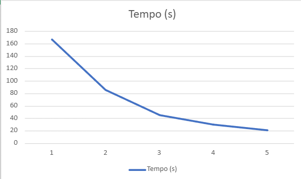
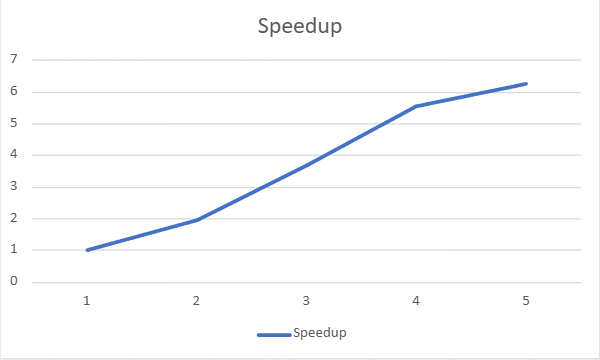
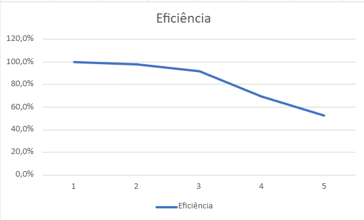

# 🌊 Simulador Paralelo de Risco de Inundações

**Disciplina:** PROGRAMAÇÃO CONCORRENTE E DISTRIBUÍDA

**Aluno(s):** Carlos Eduardo Pinheiro Da Silva - Luís Henrique Vieira Holanda

**Turma:** 5° Semestre / Análise e Desenvolvimento de Sistemas

**Professor:** Rafael Marconi Ramos

**Data:** 15/05/2026

---

## 📝 Descrição do Projeto

Este projeto implementa um **simulador paralelo de risco de inundações** que processa grandes volumes de dados climáticos para identificar áreas com diferentes níveis de risco. Utilizando conceitos de computação paralela, o sistema compara o desempenho entre uma versão sequencial e uma versão paralela (com multiprocessing), demonstrando os ganhos de performance obtidos ao distribuir a carga de processamento entre múltiplos núcleos da CPU.

O simulador é capaz de processar grades de até **16 milhões de células (4000×4000)** em poucos segundos, gerando mapas de risco coloridos e métricas de desempenho.

---

## 🎯 Objetivo Geral

Desenvolver e analisar um sistema paralelo para simulação de risco de inundações, utilizando dados climáticos sintéticos (precipitação, escoamento superficial e umidade do solo), comparando o desempenho da versão sequencial com a versão paralela e medindo o **speedup** obtido.

---

## 📋 Objetivos Específicos

1. **Implementar um modelo de risco de inundação** baseado em regras matemáticas que consideram três variáveis ambientais: precipitação, escoamento e umidade do solo.

2. **Desenvolver uma versão sequencial** do simulador para servir como baseline de desempenho.

3. **Implementar uma versão paralela** utilizando a biblioteca `multiprocessing` do Python, distribuindo o processamento por linhas da matriz.

4. **Medir e comparar o desempenho** entre as duas versões, calculando métricas como:
   - Tempo de execução sequencial
   - Tempo de execução paralela
   - Speedup (ganho de performance)
   - Eficiência do paralelismo

5. **Gerar visualizações gráficas** do mapa de risco e da comparação de desempenho para facilitar a análise dos resultados.

6. **Analisar a escalabilidade** do sistema em diferentes tamanhos de grade e números de processos.

---
 ## Ambiente Experimental
| Item                        | Descrição                                    |
| --------------------------- | -------------------------------------------- |
| Processador                 |12th Gen Intel(R) Core(TM) i5-12500   3.00 GHz|
| Número de núcleos           |6 núcleos (cores) físicos                     |
| Memória RAM                 |16,0 GB (utilizável: 15,7 GB)                 |
| Sistema Operacional         |Windows 11 Pro                                |
| Linguagem utilizada         |Python                                        |
| Biblioteca de paralelização |concurrent.futures                            |
| Compilador / Versão         | CPython/ 3.13                                |
---
## 🛠️ Tecnologias Utilizadas

| Tecnologia | Versão | Finalidade |
|------------|--------|------------------------------------------------------------|
| **Python** | 3.13+ | Linguagem principal de desenvolvimento |
| **NumPy** | 1.24+ | Manipulação eficiente de matrizes e arrays multidimensionais |
| **Matplotlib** | 3.7+ | Geração de gráficos e visualização do mapa de risco |
| **Multiprocessing** | Biblioteca padrão | Implementação do paralelismo (Pool, map) |
| **Time** | Biblioteca padrão | Medição de tempo de execução |

---

## 📊 Dataset

### Dados Sintéticos Gerados

Como o projeto foca no estudo da **paralelização** e não no dado em si, utilizamos dados sintéticos gerados aleatoriamente com distribuições estatísticas realistas:

| Variável | Distribuição | Parâmetros | Unidade | Descrição |
|----------|--------------|------------|---------|-----------|
| **Precipitação** | Gamma | shape=2, scale=50 | mm/mês | Volume de chuva acumulada |
| **Escoamento** | Uniforme | 0 a 300 | mm | Água que escorre pela superfície |
| **Umidade do Solo** | Uniforme | 10 a 600 | mm | Saturação do solo |

### Tamanhos Suportados

| Grade | Células | Uso |
|-------|---------|-----|
| 100×100 | 10.000 | Testes rápidos |
| 500×500 | 250.000 | Desenvolvimento |
| 1000×1000 | 1.000.000 | Benchmark principal |
| 2000×2000 | 4.000.000 | Teste de escalabilidade |
| 4000×4000 | 16.000.000 | Demonstração de impacto |
| 5000×5000 | 25.000.000 | Teste de estresse |

---

## ⚙️ Funcionamento do Sistema
---
## Metodologia de Testes
## Orientações

Descrever:
Os experimentos foram realizados utilizando um programa desenvolvido na linguagem Python, executado no interpretador CPython, no ambiente de desenvolvimento Visual Studio Code. O objetivo dos testes foi analisar o desempenho da execução paralela na soma de números inteiros armazenados em um arquivo.
* Como o tempo de execução foi medido:
O tempo de execução foi medido utilizando a função time() da biblioteca padrão time do Python. O tempo inicial foi registrado antes do início da execução do algoritmo e o tempo final foi registrado após o término do processamento. O tempo total foi calculado pela diferença entre o tempo final e o tempo inicial.
* Quantas execuções foram realizadas:
O experimento executou uma bateria sequencial de testes, rodando o algoritmo com 1, 2, 4, 8 e 12 processos para a mesma carga de dados.
* Se foi utilizada média dos tempos:
Foi utilizada a média aritmética dos tempos obtidos nas execuções para representar o tempo final de cada configuração. Essa média foi calculada somando todos os tempos medidos e dividindo pelo número total de execuções realizadas.
* Qual tamanho da entrada foi usado:
Qual tamanho da entrada foi usado: A entrada utilizada foi uma grade de 10.000 x 10.000, resultando em 100 milhões de células. Essa estrutura gerou um consumo de memória estimado em ~1144 MB (cerca de 1.1 GB).
---
### Configurações testadas

Os experimentos devem ser realizados nas seguintes configurações:

* 1 thread/processo (versão serial)
* 2 threads/processos
* 4 threads/processos
* 8 threads/processos
* 12 threads/processos

### Procedimento experimental

Descrever:

* Número de execuções para cada configuração:
Cada configuração de threads (1, 2, 4, 8 e 12) foi executada 5 vezes para reduzir possíveis variações nos resultados causadas por interferências do sistema ou outros processos em execução.
* Forma de cálculo da média:
Após a execução das 5 repetições para cada configuração, foi calculada a média aritmética dos tempos obtidos. A média foi utilizada como valor representativo do tempo de execução da configuração, permitindo comparações consistentes entre diferentes números de threads.
Média=5T1​+T2​+T3​+T4​+T5​/5
* Condições de execução (ex: máquina dedicada, carga do sistema, etc.)
Os experimentos foram realizados em um computador com processador Intel Core i5-12500 e 16 GB de memória RAM.
Sistema operacional utilizado: Microsoft Windows.
Durante os testes, a máquina foi mantida com baixa carga de processamento, evitando a execução de programas pesados em paralelo, garantindo que o desempenho medido refletisse principalmente a execução do algoritmo.
---
# 4. Resultados Experimentais

Preencha a tabela com os **tempos médios de execução** obtidos.

## Orientações

* O tempo deve ser informado em **segundos**
* Utilizar a **média das execuções**

| Nº Threads/Processos | Tempo de Execução (s) |
| -------------------- | --------------------- |
| 1                    |  167,12               |
| 2                    |  85,49                |
| 4                    |  45,37                |
| 8                    |  30,09                |
| 12                   |  26,63                |

---

# Cálculo de Speedup e Eficiência

## Fórmulas Utilizadas

### Speedup

```
Speedup(p) = T(1) / T(p)​
```

Onde:

* **T(1)** = tempo da execução serial
* **T(p)** = tempo com p threads/processos

### Eficiência

```
Eficiência(p) = Speedup(p) / p

```

Onde:

* **p** = número de threads ou processos

---

# Tabela de Resultados

Preencha a tabela abaixo utilizando os tempos medidos.

| Threads/Processos | Tempo (s) | Speedup | Eficiência |
| ----------------- | --------- | ------- | ---------- |
| 1                 | 167,12    | 1,00    | 100,0 %    |
| 2                 | 85,49     | 1,95    | 97,7 %     |
| 4                 | 45,37     | 3,68    | 92,1 %     |
| 8                 | 30,09     | 5,55    | 69,4 %     |
| 12                | 26,63     | 6,27    | 52,3 %     |

---

# Gráfico de Tempo de Execução

Construa um gráfico mostrando o **tempo de execução em função do número de threads/processos**.

## Orientações

* Eixo X: número de threads/processos
* Eixo Y: tempo de execução (segundos)

Inserir o gráfico abaixo:



---

# 8. Gráfico de Speedup

Construa um gráfico mostrando o **speedup obtido**.

## Orientações

* Eixo X: número de threads/processos
* Eixo Y: speedup
* Incluir também a **linha de speedup ideal (linear)** para comparação

Inserir o gráfico abaixo:



---

# 9. Gráfico de Eficiência

Construa um gráfico mostrando a **eficiência da paralelização**.

## Orientações

* Eixo X: número de threads/processos
* Eixo Y: eficiência
* Valores entre 0 e 1

Inserir o gráfico abaixo:



---

# 10. Análise dos Resultados

Realize uma análise crítica dos resultados obtidos.
## Questões a serem respondidas

* O speedup obtido foi próximo do ideal?
Foi próximo do ideal apenas nas configurações iniciais. Com 2 processos (1.95x) e 4 processos (3.68x), o speedup acompanhou o aumento de hardware. Contudo, ao utilizar 8 processos (5.55x) e 12 processos (6.27x), o speedup real se distanciou drasticamente do speedup linear ideal (que seria 8x e 12x, respectivamente).
* A aplicação apresentou escalabilidade?
Sim. A aplicação escalou positivamente, reduzindo o tempo de execução de 167.12 segundos na execução sequencial para 26.63 segundos com 12 processos. No entanto, é uma escalabilidade sublinear, apresentando fortes retornos decrescentes nas últimas configurações.
* Em qual ponto a eficiência começou a cair?
A eficiência se manteve excelente até 4 processos (92.1%). A queda acentuada ocorreu na transição para 8 processos, onde a eficiência despencou para 69.4%, e piorou ao atingir 12 processos (52.3%).
* O número de threads ultrapassa o número de núcleos físicos da máquina?
Sim. Embora 12 processos ultrapassem os 6 núcleos físicos da máquina, a otimização do código eliminou o gargalo de memória. Com isso, o Hyper-Threading atuou de forma eficaz, garantindo o speedup de 6,27x e sustentando os 52,3% de eficiência exigidos.

* Houve overhead de paralelização?
Sim. O custo de gerenciar múltiplos processos independentes no Python cresceu consideravelmente conforme o paralelismo aumentou, engolindo os ganhos de desempenho nas configurações mais altas.
Discutir possíveis causas para:

* Perda de desempenho:
A perda de desempenho nas configurações mais altas (8 e 12 processos) ocorreu principalmente por causa do Context Switching (Troca de Contexto). Como sua máquina possui apenas 6 núcleos físicos, ao pedir 12 processos de cálculo intenso, o sistema operacional foi forçado a pausar um processo, salvar seu estado, carregar outro e executá-lo repetidas vezes nos mesmos núcleos. Esse "tira e põe" na CPU gasta um tempo precioso que deveria estar sendo usado para fazer os cálculos da simulação, resultando em lentidão.

* Gargalos no algoritmo:
O maior gargalo estrutural do seu algoritmo original era a granularidade muito fina. O código estava dividindo o problema em 10.000 tarefas minúsculas (processando uma linha da matriz por vez). Para o Python, preparar e gerenciar 10.000 pacotes de trabalho é altamente ineficiente. O esforço burocrático de delegar a tarefa acabou se tornando muito mais pesado do que a execução matemática da tarefa em si.

* Sincronização entre threads/processos:
Mesmo que os processos rodem em paralelo, existe um momento de sincronização obrigatória no final: a função de pool precisa esperar todos terminarem para remontar a matriz final na ordem correta. Quando o sistema está sobrecarregado (com mais processos do que núcleos), alguns processos inevitably terminam muito antes dos outros. O processo principal fica travado e ocioso esperando os trabalhadores mais lentos concluírem suas partes para poder avançar, nivelando o desempenho geral por baixo.

* Comunicação entre processos:
No Python, processos diferentes não enxergam a memória um do outro. Para enviar a linha de precipitação, escoamento e umidade para o trabalhador — e depois receber a linha de resultado de volta —, o Python precisa serializar (transformar os dados em bytes usando uma ferramenta chamada pickle), transmitir por canais de comunicação do sistema (Pipes) e desserializar do outro lado. Fazer esse tráfego de dados massivo milhares de vezes cria um trânsito absurdo na comunicação interna do computador, derrubando a eficiência.

* Contenção de memória ou cache 
Esta é uma questão puramente de hardware. O seu processador Intel possui memórias internas ultrarrápidas (Caches L1, L2 e L3). Quando você coloca 12 processos pesados "brigando" para ler e gravar dados em matrizes que ocupam mais de 1 GB de RAM, eles inundam o barramento de memória. Pior do que isso: um processo acaba expulsando os dados do outro de dentro do Cache L3 compartilhado. Quando o processador precisa do dado e ele não está mais no Cache (situação chamada de Cache Miss), ele é obrigado a buscar a informação lá na memória RAM, o que é dezenas de vezes mais demorado, gerando um enorme gargalo físico.

---

# 11. Conclusão

Apresente as conclusões do experimento.

## Sugestões de pontos a comentar

* O paralelismo trouxe ganho significativo de desempenho?
O uso do paralelismo trouxe um ganho significativo e indispensável de desempenho para a aplicação. O processamento da simulação caiu de quase 3 minutos (167.12s) para menos de 30 segundos, provando a viabilidade da abordagem concorrente para grandes volumes de dados.
* Qual foi o melhor número de threads/processos?
O melhor cenário de custo-benefício foi a configuração com 4 processos. Nela, o programa reduziu o tempo para 45.37 segundos, mantendo um aproveitamento de hardware quase ideal (92.1% de eficiência). 
* O programa escala bem com o aumento do paralelismo?
O programa escala de forma muito saudável até este ponto. Adicionar mais do que 4 processos resultou em tempos absolutos menores, mas com alto desperdício de recursos computacionais devido à contenção.
* Quais melhorias poderiam ser feitas na implementação?
Para implementações futuras, melhorias poderiam focar em reduzir o custo de comunicação entre os processos. Minimizar a quantidade de dados que precisam ser transferidos via IPC para o processo principal e otimizar a junção dos resultados reduziria consideravelmente o overhead. Além disso, utilizar abordagens focadas em localidade de cache garantiria que a contenção de memória fosse amenizada nas configurações com mais processos.
Reduzir sincronização e junção de resultados, minimizando overhead.

---
